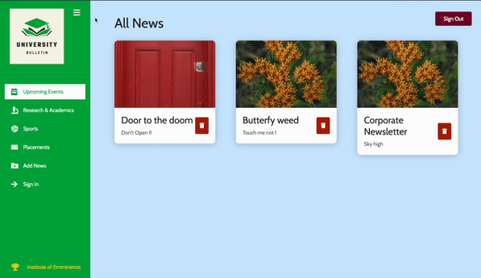

# UINIVERSITY BULLETIN

#### Video Demo: https://youtu.be/BWIbqvY15KE

## Overview of the application:

A news-feed management web application designed and developed for the purpose of providing up-to-date information for college students regarding placements, research & academics, sports, upcoming events, etc. Firstly, users will have to register for an account before accessing the dashboard via the authentication prompt. Then comes the dashboard wherein users can add news bulletin in relevant category with title, image and a short description. They'll also be able to delete news articles if they're no more relevant or up-to-date.

## Technologies used:

- [React-Js](https://reactjs.org/)
- [Firebase-auth](https://firebase.google.com/docs/auth)
- [Firebase-realtime-database](https://firebase.google.com/docs/database)

The project workflow is composed of multiple files and folders organised in a systematic manner. The code consists of REACT JS framework for building the extensive frontend of the application. The application incorporates FIREBASE authentication and realtime database for handling user authorisation and storing data related to news articles respectively.

## Explaining the project workflow:

Src folder encloses the main working code of the application. It consists of sub-directories called components, contexts, pages and a few files like App.js, firebase.js, index.js, etc.

### App.js and firebase.js files

- In App.js, BrowserRouter is implemented to enable navigation between views from different components in the application allowing the browser URL to be changed, and thus keeping the UI in sync with the URL.
- Apart from that, the App.js file consists of an AuthProvider that is imported from an AuthContext which is basically an object that handles authentication and authorization logic. It exposes methods that react-admin calls when needed, and that you can call manually through specialized hooks.
- On the other hand, firebase.js is a firebase configuration file wherein all the ids are stored safely in environment variables that are used to initialise firebase authentication.

```javascript
import firebase from "firebase/compat/app";
import "firebase/compat/auth";

const firebaseConfig = {
  apiKey: process.env.REACT_APP_FIREBASE_API_KEY,
  authDomain: process.env.REACT_APP_FIREBASE_AUTH_DOMAIN,
  databaseURL: process.env.REACT_APP_FIREBASE_DATABASE_URL,
  projectId: process.env.REACT_APP_FIREBASE_PROJECT_ID,
  storageBucket: process.env.REACT_APP_FIREBASE_STORAGE_BUCKET,
  messagingSenderId: process.env.REACT_APP_FIREBASE_MESSAGING_SENDER_ID,
  appId: process.env.REACT_APP_FIREBASE_APP_ID,
  measurementId: process.env.REACT_APP_FIREBASE_MEASUREMENT_ID,
};

// Initialize Firebase
const app = firebase.initializeApp(firebaseConfig);
export const auth = app.auth();
export default app;
```

### Components

The components folder further comprises files that have code designed to implement various features like application layout, UI, authentication and news item handling logic.

- Layout direactory includes the Layout file (Layout.js) is like a container wrapped around the BrowserRouter which encloses all other pages, components including the main navigation(MainNavigation.js) of the app. Main Navigation is a sidebar that is designed with the help of CDB react and so it's imported as a component in the Layout file.



- When the first time you visit the website, you'll prompted to sign in (Login.js) with your registered credentials to access the dashboard. But, if you don't have an account already, then you'll have to go to the sign up (Register.js) page.
- Auth folder comprises the Sign Up, Sign In and Logout components and their form handling logic that takes into account user authentication state which is provided by the AuthContext. On submitting the Sign Up form, the credentials are pushed to the firebase sign-in provider database which is further queried by the Sign In component to validate whether the user credentials are correct.

|                  Sign In                   |                     Sign out                     |
| :----------------------------------------: | :----------------------------------------------: |
|  |  |

- News directory contains three JSX files that holds the logic to add a news item with all the required details, display the entire list of news items acccording to category with the help of fetch API that sends get requests to fetch data from the firebase realtime database, and finally deleting the news item by mapping the news id to delete the only clicked item.

### Pages

The pages directory contains all the different dashboard routes like placements, research, sports, upcoming events, wherein the news list is fetched from the realtime database and displayed to the users. It also has the add news item page which pushes news article data to the same realtime database.

```javascript
function addNewsHandler(newsData) {
  fetch(process.env.REACT_APP_FIREBASE_REALTIME_DATABASE_URL + "/news.json", {
    method: "POST",
    body: JSON.stringify(newsData),
    headers: {
      "Content-Type": "application/json",
    },
  }).then(() => {
    navigate("/");
  });
}
```

### Contexts

- The Contexts folder holds two files namely the AuthContext that is added to pass current user authenticated data through the component tree for implementing the user authorisation.
- The other file called PrivateRoute comprises logic that ensures users won't be able to access other dashboard routes apart from sign in, sign up pages unless they are signed in.

## Documentation

- https://reactjs.org/
- https://firebase.google.com/docs/auth
- https://firebase.google.com/docs/database

